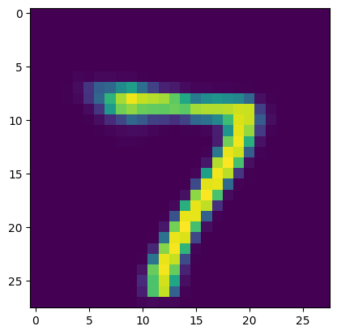
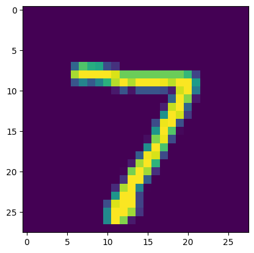

# 생성 모델 — VAE & GAN / Generative Models: VAE & GAN

> **English summary.** Two families of generative models trained on MNIST: a **Variational Autoencoder (VAE)** in PyTorch — encoder/decoder with a probabilistic latent space and the reconstruction + KL objective — and a **Deep Convolutional GAN (DCGAN)** in TensorFlow/Keras — a generator and discriminator trained adversarially.


---

## 개요

이미지를 **생성**하는 두 가지 대표 접근 — **VAE**(확률적 잠재공간 기반)와 **GAN**(적대적 학습) — 을 MNIST로 각각 구현·비교한 노트북입니다. 프레임워크도 PyTorch·TensorFlow 양쪽을 다룹니다.

## 노트북 구성

| # | 노트북 | 모델 | 프레임워크 |
|---|--------|------|-----------|
| 01 | [vae_pytorch](notebooks/01_vae_pytorch.ipynb) | **VAE** — 인코더/디코더, 잠재변수 샘플링(reparameterization), 복원 손실 + KL 발산 | PyTorch |
| 02 | [gan_tensorflow](notebooks/02_gan_tensorflow.ipynb) | **DCGAN** — Generator vs Discriminator 적대 학습, 체크포인트 저장, 생성 과정 시각화 | TensorFlow/Keras |

## 다룬 개념

- **VAE**: 잠재공간(latent space)으로 압축·복원, 확률적 인코딩, 복원 손실과 KL 정규화의 균형
- **GAN**: 생성자–판별자의 미니맥스 학습, DCGAN 구조, 학습 안정화
- 두 생성 모델의 **접근 방식 차이**(명시적 확률 모델 vs 암묵적 적대 학습) 비교

## 결과 시각화

VAE 노트북의 실제 출력입니다.

| | |
|:---:|:---:|
|  |  |

VAE가 잠재공간(latent space)에서 복원·생성한 MNIST 이미지입니다.

## 실행 방법

```bash
# VAE
pip install torch torchvision numpy matplotlib tqdm
# GAN
pip install tensorflow imageio matplotlib
jupyter notebook
```

## 참고

- Keras로 구현한 DCGAN(별도 과정): [gan-mnist-image-generation](https://github.com/NvidiaSeoul/gan-mnist-image-generation)
- 오토인코더(Keras): [deep-learning-keras](https://github.com/NvidiaSeoul/deep-learning-keras)

---
> NVIDIA AI Academy Seoul 교육과정 실습 — [전체 포트폴리오](https://github.com/NvidiaSeoul)
